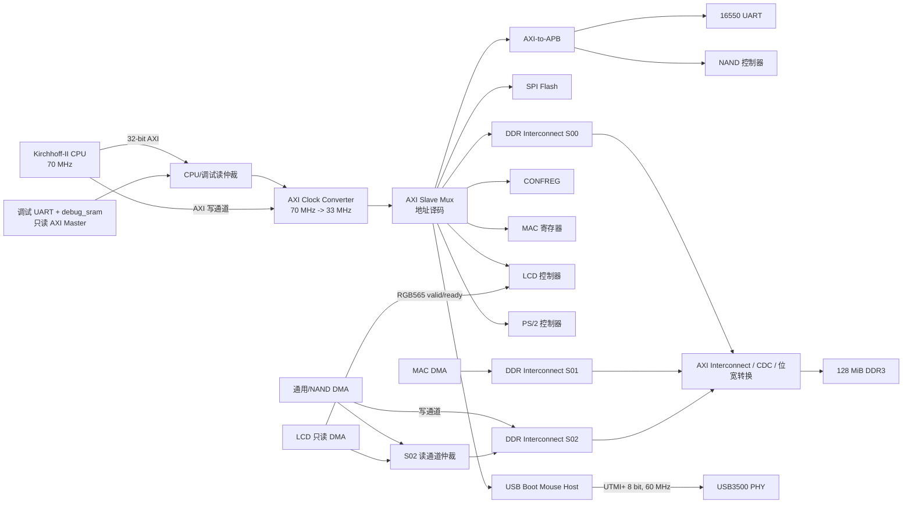
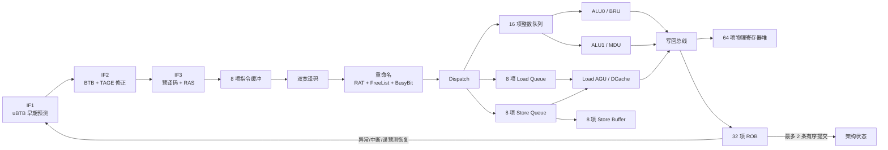

# Kirchhoff-II SoC 系统设计说明

> 文档用途：项目答辩与系统设计汇报  
> 文档范围：`chiplab_modify` 中龙芯实验箱版本的 SoC、Kirchhoff-II CPU 与板级外设互连  
> 设计依据：当前 RTL、CPU Chisel 源码以及 Linux 设备树/驱动；不以早期方案图代替当前实现

## 1. 设计目标与系统定位

Kirchhoff-II SoC 面向 LoongArch32 Reduced（LA32R）处理器验证和完整 Linux 系统运行。系统不是只完成 CPU 核心功能测试，而是将自研乱序处理器、DDR3 主存、启动 Flash、串口、NAND、网络、LCD、PS/2 和 USB 鼠标等模块集成为可独立启动的 FPGA 计算机系统。

当前系统的主要能力如下：

- 自研 32 位 LA32R 双宽乱序处理器，支持虚拟存储、精确异常、中断和 Linux 所需的 CSR/TLB 功能。
- 16 KiB ICache、16 KiB DCache、4 个 MSHR，并通过一条 32 位 AXI 主接口访问 SoC。
- 128 MiB DDR3 作为程序和数据主存，支持 CPU、以太网 DMA、NAND/通用 DMA 和 LCD DMA 共同访问。
- 从 `0x1c00_0000` SPI Flash 启动，随后可运行 U-Boot 和 Linux。
- NAND 保存内核及 UBIFS 根文件系统；MAC 提供有线网络；LCD 提供 800×480 RGB565 帧缓冲显示。
- PS/2 键盘与专用 USB HID Boot Mouse 主机提供人机输入。
- 调试串口、退休状态和 AXI 诊断信号用于板级故障定位。

本设计采用“CPU 内部统一 AXI出口 + SoC 地址译码 + DDR 多主仲裁”的组织方式。CPU 只需要遵守标准 AXI 请求/响应语义，不需要感知每种外设的物理协议；每个外设控制器负责把 AXI 寄存器访问转换为 UART、SPI、NAND、LCD 8080、PS/2 或 USB UTMI+ 时序。

## 2. SoC 总体结构



从系统互连角度，可以把模块分为三类：

1. **AXI 主设备**：CPU、调试读主机、MAC DMA、通用/NAND DMA、LCD DMA。
2. **CPU 可访问的 AXI 从设备**：DDR3、SPI、APB 桥、CONFREG、MAC 寄存器、LCD、PS/2、USB 鼠标主机。
3. **板级协议端点**：UART、NAND Flash、SPI Flash、以太网 PHY、LCD、PS/2、USB3500 和 DDR3 芯片。

## 3. 时钟与复位设计

### 3.1 时钟域

| 时钟域 | 当前频率/来源 | 主要模块 |
|---|---:|---|
| 板载系统时钟 | 100 MHz 外部输入 | PLL、MIG 系统输入 |
| `cpu_clk` | 70 MHz | Kirchhoff-II CPU、CPU 侧读仲裁、调试模块 |
| `aclk` / `uncore_clk` | 约 33.019 MHz | 地址译码、外设寄存器、APB、DMA、LCD、CONFREG |
| `usb_clk` | USB3500 `CLKOUT`，60 MHz | USB UTMI+ 包引擎 |
| DDR 参考时钟 | 200 MHz | MIG 参考输入 |
| `c1_clk0` | MIG 产生的 UI 时钟 | DDR 侧 AXI interconnect 与 MIG 用户接口 |
| MAC 收发时钟 | 外部 `mrxclk_0`/`mtxclk_0` | 以太网收发数据路径 |

需要注意，`soc_top.v` 部分历史注释仍写有“CPU 50 MHz”，但当前 `clk_pll_33.xci` 的实际输出和 `config.h` 的 `FREQ` 均为 **70 MHz**。答辩中应以当前 IP 参数为准。

### 3.2 跨时钟处理

- CPU 的完整 AXI 接口通过 `axi_clock_converter_0` 从 70 MHz 跨到约 33 MHz。
- DDR interconnect 的 S00/S01/S02 位于 33 MHz 域，M00 位于 MIG UI 时钟域，interconnect 内部完成 CDC。
- USB 控制寄存器位于 33 MHz 域，USB 包引擎位于 60 MHz 域。控制请求和完成事件采用 toggle 同步，状态信号采用多级同步；TX/RX buffer 在一次事务期间按时钟域划分所有权。
- CPU 外部中断在 `CoreTop` 内再进行两级同步后送入 CSR，降低异步输入的亚稳态风险。

### 3.3 复位顺序

外部复位首先拉低 `system_resetn` 并复位 MIG。MIG 完成 DDR 校准后，DDR interconnect 才释放 `aresetn`；CPU 域再对该信号进行两级同步，形成 `cpu_aresetn`。因此 CPU 和外设不会在 DDR 尚不可用时提前运行。

软件可向 `0x1fd0_f034` 写入 `0x5a5a_a5a5` 请求整机复位。板级复位控制器会在约 33 MHz 域保持复位 329 拍，约为 10 μs，然后重新等待 DDR 初始化。复位脉冲控制器只由外部复位清除，避免软件复位在中途清掉自身请求。

## 4. Kirchhoff-II CPU 设计

### 4.1 核心参数

| 项目 | 当前配置 |
|---|---:|
| 指令集 | LoongArch32 Reduced，32 位 |
| 复位 PC | `0x1c00_0000` |
| 取指宽度 | 2 条/拍 |
| 重命名宽度 | 2 条/拍 |
| 整数发射宽度 | 2 条/拍 |
| Load/Store 发射宽度 | 1 条/拍 |
| 提交宽度 | 2 条/拍 |
| ROB | 32 项 |
| 物理寄存器 | 64 项 |
| 整数发射队列 | 16 项 |
| Load Queue / Store Queue | 8 项 / 8 项 |
| Store Buffer | 8 项 |
| Checkpoint Buffer | 8 项 |
| TLB | 32 项，3 个翻译端口 |
| ICache | 16 KiB，4 路，64 B Cache Line |
| DCache | 16 KiB，4 路，64 B Cache Line |
| MSHR | 4 项，每项最多 4 个 Load waiter |
| CPU 外部 AXI | 32 位地址、32 位数据、4 位 ID |

综合配置关闭 DiffTest 和大规模性能计数器，保留轻量级退休、ROB、Store Buffer、MSHR、DCache 和 CSR 诊断信号，兼顾板级可观测性与资源开销。

### 4.2 CPU 内部流水



#### 前端

前端采用三级顺序取指流水：

- IF1 使用 128 项、2 路 uBTB 产生早期目标，同时向 ICache、主 BTB 和 TAGE 发起查询。
- IF2 使用 1024 项 BTB 和小型 TAGE 方向预测器修正 uBTB 结果。TAGE 包含一张 1024 项 base table 和三张 tagged table，历史长度为 4/10/24。
- IF3 对 ICache 返回的双指令包进行预译码，并利用 16 项 RAS 修正函数调用/返回目标。
- 分支预测训练只使用 ROB 有序退休结果，避免错误路径污染提交态训练序列。

#### 重命名与乱序执行

双宽 Decode 后，Rename 使用 RAT 将 32 个架构寄存器映射到 64 项物理寄存器，通过 FreeList 分配新目的寄存器，BusyBit 记录数据是否就绪。ROB、整数队列、LQ 和 SQ 采用批级原子分配：同一批指令只有在所有目标结构都有容量时才整体进入，避免半批提交造成恢复困难。

整数队列按年龄选择就绪指令：lane 0 服务 ALU0/移位/分支单元，lane 1 服务 ALU1/移位/乘除单元。BRU 在执行后产生真实跳转结果；若预测错误，Checkpoint Buffer 恢复 RAT、FreeList 和分支历史，ROB 清除年轻指令，前端重定向到正确 PC。

#### 精确提交、异常和中断

所有指令最终由 ROB 按程序顺序、每拍最多两条提交。执行可以乱序，但寄存器架构状态、Store 生效、CSR 修改、TLB/Cache 维护和异常入口都在 ROB 头部有序发生，因此保证精确异常。

外部中断先进入 CSR 的 ESTAT/ECFG 判断逻辑，只有在提交边界满足条件时才打断正常控制流。异常、`ERTN`、TLB 重填、分支误预测和内存顺序违例都通过统一的 ROB flush/redirect 机制恢复。

### 4.3 CPU 取指和数据访存通路

取指通路为：

```text
FetchPipeline
  -> ICache
  -> TLB translate(0)
  -> ICache miss/uncached request
  -> AxiController icache port
  -> CPU AXI read channel
```

数据通路为：

```text
Load/Store Queue
  -> AGU
  -> TLB translate(1/2)
  -> DCache
  -> hit: directly return/write
  -> miss: MSHR refill
  -> uncached/SUC: AXI single transaction
  -> DcacheAxiArbiter
  -> AxiController dcache port
  -> CPU AXI
```

ICache 使用一个读事务槽，4 个 MSHR 各占一个读事务槽，DCache direct/SUC 使用一个读事务槽，因此当前 CPU AXI 最多规划 6 个并发读事务。AXI ID 用来将返回数据送回正确的 ICache/MSHR/uncached owner。

Store 不会在乱序执行阶段直接修改 Cache 或外设。普通 Store 先进入可冲刷 Store Buffer，只有 ROB 提交后才允许写 DCache、分配 MSHR 或发起 AXI；DBAR/IBAR 则等待相关访存排空。这是系统保持精确异常和内存顺序的关键。

## 5. CPU 到外设的 AXI 通路

CPU 对外只暴露一组 AXI 主接口，但读路径允许调试 UART 的内存查询主机共同使用：

```text
CPU read ---------+
                  +-> 2x1 read mux -> AXI clock converter -> address decoder
debug_sram read --+

CPU write -----------------------> AXI clock converter -> address decoder
```

`debug_sram` 只发起读请求，不参与写通道。地址和数据跨入 33 MHz 域后，`axi_slave_mux` 独立译码读地址和写地址，并保存写地址对应的目标编号，保证分离的 AW/W/B 通道仍返回到同一个从设备。

AXI 五个通道的作用为：

- AR：读地址、ID、突发长度和属性。
- R：读数据、响应、ID 和末拍标志。
- AW：写地址、ID、突发长度和属性。
- W：写数据、字节有效和末拍标志。
- B：写完成响应及 ID。

这种接口使缓存行填充可使用 INCR burst，而 UART、CONFREG、PS/2 和 USB 等寄存器仍可使用单拍读写。

## 6. 软件可见地址空间

### 6.1 一级地址译码

| 物理地址范围 | 目标 | 说明 |
|---|---|---|
| `0x0000_0000`–`0x07ff_ffff` | DDR3 | Linux 设备树声明 128 MiB 主存 |
| `0x1c00_0000`–`0x1c0f_ffff` | SPI Flash 启动窗口 | CPU 复位 PC 位于该窗口 |
| `0x1fa0_0000`–`0x1fa0_ffff` | USB 鼠标主机 | Linux 映射其中 4 KiB |
| `0x1fb0_0000`–`0x1fb0_ffff` | PS/2 | Linux 映射其中 4 KiB |
| `0x1fc0_0000`–`0x1fc0_ffff` | LCD 控制器 | Linux 映射其中 4 KiB |
| `0x1fd0_0000`–`0x1fd0_ffff` | CONFREG | 板级控制、LCD DMA 参数、软件复位 |
| `0x1fe0_0000`–`0x1fe0_ffff` | AXI-to-APB | UART，兼容 `0x0fe0_xxxx` 别名 |
| `0x1fe7_0000`–`0x1fe7_ffff` | AXI-to-APB | NAND，兼容 `0x0fe7_xxxx` 别名 |
| `0x1fe8_0000`–`0x1fe8_ffff` | SPI 控制器寄存器/访问口 | 启动 Flash 的控制窗口 |
| `0x1ff0_0000`–`0x1ff0_ffff` | 以太网 MAC 寄存器 | MAC 内部另有 AXI DMA 主端 |
| 其余未命中窗口 | DDR 通路 | MIG 最终只使用地址低 27 位，软件应避免非法别名 |

启动窗口的独立译码非常重要：复位后 CPU 从 `0x1c00_0000` 取第一条指令，ICache miss 经过 AXI 地址译码直接到 SPI Flash；U-Boot 初始化 DDR 后，程序和 Linux 再主要在低 128 MiB DDR 中运行。

### 6.2 CONFREG 关键寄存器

| 地址 | 功能 |
|---|---|
| `0x1fd0_0000` | `cr00`，当前连接 LCD DMA framebuffer 物理地址 |
| `0x1fd0_0004` | `cr01`，当前连接 LCD DMA 像素数量 |
| `0x1fd0_0008` | `cr02[0]`，LCD DMA start |
| `0x1fd0_000c`–`0x1fd0_001c` | `cr03`–`cr07`，通用配置寄存器 |
| `0x1fd0_1160` | 通用/NAND DMA order 地址与控制 |
| `0x1fd0_e000` | 32 位定时器 |
| `0x1fd0_f000` | 16 位 LED |
| `0x1fd0_f004` / `0x1fd0_f008` | 两组双色 LED |
| `0x1fd0_f010` | 八位数码管显示值 |
| `0x1fd0_f020` | 拨码开关输入 |
| `0x1fd0_f024` | 4×4 矩阵键盘输入 |
| `0x1fd0_f028` | 两个步进按键输入 |
| `0x1fd0_f030` | CPU 频率常数，当前为 70,000,000 |
| `0x1fd0_f034` | 软件复位，写入 `0x5a5a_a5a5` 生效 |

## 7. DDR3 与多主设备互连

### 7.1 DDR 端口分配

| DDR interconnect 端口 | 主设备 | 数据宽度 | 典型流量 |
|---|---|---:|---|
| S00 | CPU 经地址译码后的 DDR 请求 | 32 bit | 取指 refill、Load/Store、页表、程序数据 |
| S01 | Ethernet MAC DMA | 32 bit | TX 从 DDR 读，RX 向 DDR 写 |
| S02 写通道 | 通用/NAND DMA | 64 bit | NAND/外设数据写入 DDR |
| S02 读通道 | 通用/NAND DMA 与 LCD DMA 共用 | 64 bit | DDR 到 NAND/外设，或 framebuffer 到 LCD |
| M00 | MIG AXI 从端 | 32 bit | interconnect 仲裁、CDC 和位宽转换后的总流量 |

MIG 只接收 27 位地址，因此物理容量为 128 MiB。DDR interconnect 同时承担主设备仲裁、33 MHz 到 MIG UI 时钟的跨域，以及 S02 64 位到 M00 32 位的位宽转换。

### 7.2 LCD DMA 与通用 DMA 的 S02 读仲裁

LCD DMA 是后来增加的只读主设备。当前没有修改 DDR interconnect 的端口数量，而是在 `soc_top` 中增加一个小型读仲裁器：

```text
dma_master AR ----+
                  +-> owner arbiter -> S02 AR -> DDR
lcd_dma AR -------+

DDR S02 R -> registered owner -> dma_master R 或 lcd_dma R
```

仲裁规则如下：

1. 只有在 S02 没有未完成读 burst 时才接收新的 AR。
2. 通用 `dma_master` 有请求时优先；它空闲时 LCD DMA 才获得读通道。
3. AR 握手时锁存 `s02_r_owner_lcd`，直至收到 `RVALID && RREADY && RLAST`。
4. 读响应只送给锁存的 owner，另一路看到的 `RVALID` 为 0。

这样既避免改动原 DDR interconnect 的接口，也防止一个 burst 的返回数据被中途切换给另一个 DMA。

### 7.3 DMA 一致性边界

当前 SoC 没有硬件 Cache snoop，CPU DCache 与外设 DMA 是 **非一致性系统**。因此软件必须遵循以下规则：

- CPU 写完待 DMA 读取的缓冲区后，要 clean/flush 对应 DCache 数据。
- DMA 写完内存、CPU 准备读取前，要 invalidate 对应 DCache 数据。
- Linux 驱动优先使用 DMA API 和 coherent buffer，而不是直接把普通 cached 内存地址交给硬件。
- framebuffer、网络描述符和 NAND 数据缓冲区都属于该一致性边界的一部分。

## 8. 外设设计与数据通路

### 8.1 SPI Flash 与启动通路

SPI 控制器是 AXI 从设备，既响应 `0x1fe8_xxxx` 控制/访问窗口，也响应 `0x1c0x_xxxx` 启动映射。复位取指的完整路径为：

```text
PC=0x1c000000
 -> ICache miss
 -> CPU AXI AR
 -> CPU/debug 读仲裁
 -> AXI CDC
 -> axi_slave_mux S1
 -> spi_flash_ctrl
 -> SPI_CLK / SPI_CS / MOSI / MISO
 -> AXI R
 -> ICache refill
 -> FetchPipeline
```

SPI 中断接入 CPU，但正常的启动取指和轮询访问不依赖中断。

### 8.2 UART 与 AXI-to-APB

CPU 访问 16550 兼容 UART 的典型地址为 `0x1fe0_01e0`。请求先被一级 AXI 译码送到 APB 子系统，再由 `axi2apb_bridge` 转换为 APB setup/access 两阶段传输。APB 子译码把低地址设备分配给 UART，UART 内部包含收发 FIFO、波特率分频、状态和中断逻辑。

```text
CPU store/load
 -> AXI CDC
 -> axi_slave_mux S2
 -> AXI-to-APB
 -> APB mux
 -> UART registers/FIFO
 -> UART_TX/UART_RX
```

系统串口时钟为约 33 MHz，Linux 使用 `ttyS0,115200` 作为控制台。UART 中断接入 `int_out[1]`。

### 8.3 NAND 与通用 DMA

NAND 控制器位于 `0x1fe7_8000` 附近，通过 APB 配置命令、地址、时序、操作长度和状态。控制器负责产生 CLE、ALE、CE、RD、WR 和双向 8 位数据总线时序。

大量页数据不由 CPU 逐字节搬运，而由 `dma_master` 在 APB 与 DDR 之间传输：

```text
CPU 写 NAND 命令/参数
 -> NAND controller 发出 dma_req
 -> dma_master 读取 CONFREG order
 -> 获取 APB 总线授权
 -> NAND APB data <-> DMA 32-word buffer
 -> 64-bit AXI burst <-> DDR S02
 -> 完成标志/中断
```

APB mux 在 CPU 和 DMA 同时请求时保存当前授权，保证一次 APB 传输不被截断。NAND 控制器还有独立操作完成中断；DMA 也有自己的完成中断。

Linux 中 NAND 作为 MTD 设备使用，当前板级介质为 128 MiB SLC NAND，页大小 2 KiB、OOB 64 B、擦除块 128 KiB。内核和 rootfs 通过 NAND 分区、UBI 和 UBIFS 组成持久化启动链路。

### 8.4 Ethernet MAC 与独立 DMA

MAC 的寄存器从端位于 `0x1ff0_0000`，CPU 用它配置描述符、收发状态、MAC 地址和 MDIO。MAC 另有独立 AXI 主端接 DDR S01：

- 发送：MAC DMA 根据 TX 描述符从 DDR 读取帧，再经 MII 数据线发给 PHY。
- 接收：MAC 从 PHY 接收帧，DMA 将数据写入 DDR 缓冲区，再产生中断通知驱动。

因此网络包的数据面无需经过 CPU 逐字节复制，CPU 只负责描述符管理、协议栈和 Cache/DMA 一致性维护。

### 8.5 LCD 控制器和显示 DMA

LCD 控制器通过 16 位 8080 并行总线驱动面板，软件寄存器为：

| 地址 | 寄存器 | 功能 |
|---|---|---|
| `0x1fc0_0000` | CMD | 写 LCD 命令，`RS=0` |
| `0x1fc0_0004` | DATA | 写 LCD 数据，`RS=1` |
| `0x1fc0_0008` | STAT | FSM、FIFO 和写计数状态 |
| `0x1fc0_000c` | CTRL | bit0 LCD reset，bit1 背光 |

CPU 命令/数据与 DMA 像素共用 16 项 `{RS, data[15:0]}` FIFO。FIFO 后的四态 FSM 依次产生 SETUP、`WR#` 拉低和 HOLD 时序。FIFO 满时，CPU 写通过 AXI `WREADY` 反压，DMA 通过 `pixel_ready` 反压，不会静默丢像素。

LCD DMA 数据路径为：

```text
Linux framebuffer (DDR, RGB565)
 -> CONFREG: fb_addr / pixel_count / start pulse
 -> lcd_dma 64-bit AXI INCR read, max 16 beats
 -> 每个 64-bit beat 拆为 4 个 16-bit pixel
 -> valid/ready stream
 -> LCD 16-entry FIFO
 -> 8080 write FSM
 -> LCD panel
```

Linux framebuffer 分辨率为 800×480，RGB565，每行 1600 B，总大小 768000 B。驱动先设置面板更新窗口，再写 `cr00`、`cr01`，最后将 `cr02[0]` 置 1 后清 0，形成 DMA 启动脉冲。

`lcd_dma` 当前输出 `busy/done/error`，但这些状态尚未映射为软件可读寄存器，驱动仍按像素数估计等待时间；这是后续可增强点。触摸屏 SPI 引脚当前保持安全空闲状态，尚未实现触摸控制器。

### 8.6 PS/2 控制器

PS/2 控制器位于 `0x1fb0_0000`，主要寄存器为 DATA、STAT、CTRL 和 TEST。外部 PS/2 CLK/DATA 先经过双触发同步和 16 拍数字滤波，再在时钟下降沿接收 start、8 位数据、奇校验和 stop 位。接收数据进入 16×8 bit FIFO。

控制器还包含主机发送状态机、超时、奇偶校验、帧错误和 FIFO overflow 标志。RTL 提供 `ps2_int`，当前 Linux 驱动为提高兼容性采用轮询方式从 FIFO 取扫描码，再交给 serio/atkbd 输入子系统。

### 8.7 专用 USB HID Boot Mouse 主机

USB 模块不是通用 OHCI/EHCI/XHCI 控制器，而是为“一只直接连接的有线 HID Boot Mouse”设计的轻量主机。它支持低速/全速、端点 0 控制传输、Interrupt IN 轮询、DATA0/DATA1 toggle、CRC5/CRC16、ACK/NAK/STALL 和端口复位；不支持 Hub、U 盘、摄像头或任意 USB class。

硬件分为两个时钟域：

```text
33 MHz AXI register bank
  - CONTROL / STATUS / TOKEN / IRQ
  - 64-byte TX buffer
  - 64-byte RX buffer
  - request/done toggle CDC

60 MHz USB packet engine
  - connect/speed detection
  - UTMI+ transmit/receive
  - token/data/handshake state machine
  - CRC and timeout
  - USB3500 control pins
```

USB v1.5 包引擎在发送 SETUP/OUT token 后，不再用固定延时猜测 token 已经发完，而是观察物理 `LINESTATE` 的 SE0 EOP 和随后 J 状态，在至少两个 bit time 后发送 DATA。这保证 USB3500 即使提前用 `TXREADY` 接收并缓存多个 token byte，也不会让 DATA 包与线上仍在发送的 token 重叠。

主要寄存器如下：

| 偏移 | 名称 | 关键字段 |
|---:|---|---|
| `0x00` | CONTROL | bit0 enable，bit1 IRQ enable，bit2 start，bit3 port reset |
| `0x04` | STATUS | connected、speed、busy、PHY ready、result、RX length、LINESTATE |
| `0x08` | TOKEN | 地址、端点、事务类型、toggle、TX/RX 长度 |
| `0x0c` | IRQ | transfer/reset/connect，写 1 清除 |
| `0x10` | VERSION | 当前 `0x554d0105` |
| `0x14` | PHY | TXREADY/RX/Session/VBUS/ID 状态 |
| `0x18` | DEBUG | 包引擎调试计数与状态 |
| `0x1c` | TRACE | TX trace 元信息 |
| `0x40`–`0x7f` | TX buffer | 最多 64 B |
| `0x80`–`0xbf` | RX buffer | 最多 64 B |
| `0xc0`–`0xcf` | TX trace | 最近一次事务的发送字节 |

Linux 驱动不注册标准 USB HCD，而是直接完成最小枚举：

```text
port reset
 -> GET_DESCRIPTOR(device, 8 B)
 -> SET_ADDRESS(1)
 -> GET_DESCRIPTOR(configuration)
 -> 查找 HID boot mouse interrupt-IN endpoint
 -> SET_CONFIGURATION
 -> SET_PROTOCOL(boot)
 -> 按 bInterval 轮询 Interrupt IN
 -> Linux input subsystem
```

鼠标报告首字节的 bit0/bit1/bit2 分别映射 BTN_LEFT、BTN_RIGHT、BTN_MIDDLE。驱动既支持标准 3/4 字节 Boot Mouse 报告，也兼容实验箱鼠标的 5/6 字节报告：后者的 X/Y 为 little-endian 16 位相对位移。输入最终通过 `/dev/input/eventX` 和 `/dev/input/mice` 提供给用户程序。

## 9. 中断通路

顶层将 7 路外设中断组合后送入 CPU 的 8 位 `intrpt`，最高位固定为 0：

| `int_out` 位 | 中断源 | 典型原因 |
|---:|---|---|
| 0 | Ethernet MAC | 收包、发包完成、错误 |
| 1 | UART0 | RX/TX FIFO、线路状态 |
| 2 | SPI | SPI 事务完成/状态 |
| 3 | NAND | NAND 操作完成/错误 |
| 4 | 通用 DMA | DMA 搬运完成 |
| 5 | USB mouse host | connect、reset、transaction complete |
| 6 | PS/2 | RX 数据或 TX 状态 |

```text
peripheral irq
 -> int_out[6:0]
 -> kirchhoff_core_top.intrpt[7:0]
 -> CoreTop 两级同步
 -> CSR ESTAT/ECFG
 -> ROB 提交边界接收中断
 -> 保存 ERA/PRMD，跳转 EENTRY
 -> Linux 中断处理程序
```

精确中断意味着 ROB 中比中断边界更老的指令可以完成，而更年轻的推测状态被清除；处理结束执行 `ERTN` 后从保存的 ERA 恢复。

## 10. 典型端到端通路

### 10.1 Linux 普通 Load

```text
指令取到并重命名
 -> Load Queue 选中最老就绪项
 -> 读物理寄存器、AGU 生成虚拟地址
 -> TLB 翻译并检查权限/MAT
 -> DCache lookup
 -> hit: 数据写回 PRF，ROB 标记完成
 -> miss: MSHR 发 AXI burst 到 DDR，填充后重放
 -> ROB 有序提交
```

### 10.2 串口打印一个字符

```text
CPU Store
 -> Store Queue / Store Buffer
 -> ROB 提交后发 uncached AXI write
 -> 70->33 MHz CDC
 -> 地址译码 0x1fe0_xxxx
 -> AXI-to-APB
 -> UART TX FIFO
 -> 串行移位输出
```

### 10.3 NAND 页读入内存

```text
Linux NAND driver 配置 NAND 寄存器与 DMA order
 -> NAND 发命令/地址并请求 DMA
 -> dma_master 获得 APB
 -> NAND 8-bit 数据进入 DMA buffer
 -> DMA 64-bit burst 写 DDR S02
 -> NAND/DMA 中断
 -> 驱动检查 ECC 并交给 MTD/UBI/UBIFS
```

### 10.4 LCD 刷新

```text
应用写 /dev/fb0
 -> Linux shadow framebuffer
 -> 驱动设置 LCD 地址窗口
 -> CONFREG 启动 lcd_dma
 -> DDR S02 读仲裁
 -> 64-bit beat 拆分 RGB565
 -> LCD FIFO
 -> 8080 bus
```

### 10.5 鼠标移动或按键

```text
Linux 驱动发 Interrupt IN token
 -> AXI register request 跨到 USB 60 MHz 域
 -> UTMI+ packet engine / USB3500
 -> 鼠标返回 DATA0/DATA1 report
 -> CRC 校验与 ACK
 -> RX buffer
 -> 驱动解析 buttons/X/Y/wheel
 -> input_report_key/input_report_rel
 -> /dev/input/eventX 和 /dev/input/mice
```

## 11. 调试与可观测性

系统保留以下硬件调试能力：

- `UART_RX2/UART_TX2` 调试模块可查询退休 PC、物理寄存器结果和指定内存字节。
- `debug_sram` 是只读 AXI master，与 CPU 读通路经过 2×1 仲裁，不会直接修改系统内存。
- CPU 导出 ROB 队头、Store Buffer 头地址、MSHR、DCache、ERA/EENTRY/ESTAT/BADV 等轻量诊断状态。
- 顶层 AXI probe 记录 CPU、CDC、DDR S00、MIG 和 APB 的最近 AR/AW 及响应状态。
- `SW7=1` 时数码管切换为非侵入式 AXI/CPU 诊断显示，`SW7=0` 时仍由 CONFREG 正常驱动。
- USB 提供 VERSION、PHY、DEBUG 和发送 trace 寄存器，可区分“软件未发事务、PHY 未接受并行字节、物理线未活动、设备未响应”等故障层次。

顶层虽然保留 EJTAG 引脚声明，但当前 `soc_top` 没有实例化有效 EJTAG 数据通路，答辩时不应将其列为已经实现的调试功能。

## 12. 当前设计边界与后续改进

当前设计已经形成可启动 Linux、可访问主要外设的完整 SoC，但仍有明确边界：

1. USB 是专用 Boot Mouse 主机，不是通用 USB Host Controller。
2. LCD DMA 的 `busy/done/error` 尚未软件可见，驱动依靠时间估算等待完成。
3. LCD DMA 与通用/NAND DMA 共用 S02 读端口，大量刷屏会与 NAND DMA 产生带宽竞争。
4. CPU Cache 与 DMA 不具备硬件一致性，软件必须执行正确的 DMA Cache 维护。
5. PS/2 RTL 有中断和发送能力，但当前 Linux 键盘主路径采用接收轮询。
6. LCD 触摸接口尚未实现，只保持引脚安全状态。
7. 一级译码默认目标是 DDR，且 MIG 截取地址低 27 位；非法地址不会自动产生总线错误，软件必须严格遵守地址表。
8. DDR interconnect 针对本项目的 INCR burst、CDC 和位宽转换需求实现，不应被描述为支持任意 AXI corner case 的通用 NoC。

后续优先级较高的增强方向是：为 LCD DMA 增加状态/中断寄存器；为 DMA 建立统一的 Linux coherent API 使用规范；将 USB 主机逐步扩展为标准 HCD，或在保持专用方案的前提下增加更多 HID 描述符兼容性；为非法地址增加 DECERR 从设备。

## 13. 主要实现文件

| 内容 | 文件 |
|---|---|
| SoC 顶层与全部互连 | `chiplab_modify/chip/soc_demo/loongson/soc_top.v` |
| CPU FPGA wrapper | `chiplab_modify/IP/myCPU/kirchhoff_core_top.v` |
| CPU 总体结构 | `src/src/main/scala/coretop/CoreTop.scala` |
| CPU 参数 | `src/src/main/scala/common/Config.scala` |
| AXI 地址译码 | `chiplab_modify/IP/AMBA/axi_mux_syn.v` |
| DDR 多主 interconnect | `chiplab_modify/IP/AXI/axi_interconnect_0.v` |
| CPU/调试读仲裁 | `chiplab_modify/IP/AXI/axi_2x1_mux_2025_wrapper.v` |
| 通用/NAND DMA | `chiplab_modify/IP/DMA/dma.v` |
| LCD 控制器与 DMA | `chiplab_modify/IP/LCD/lcd_ctrl.v`、`lcd_dma.v` |
| USB 鼠标主机 | `chiplab_modify/IP/USB/usb_mouse_host.v` |
| PS/2 控制器 | `chiplab_modify/IP/PS2/ps2_ctrl.v` |
| APB/UART/NAND 集成 | `chiplab_modify/IP/APB_DEV/apb_dev_top_with_nand.v` |
| Linux 设备树 | `longxin/la32r-Linux/arch/loongarch/boot/dts/loongson/loongson32_ls.dts` |
| LCD Linux 驱动 | `longxin/la32r-Linux/drivers/video/fbdev/ls1a-lcdfb.c` |
| USB 鼠标 Linux 驱动 | `longxin/la32r-Linux/drivers/input/mouse/ls1a-usb-mouse.c` |

## 14. 答辩汇报建议

建议用四张主图完成 SoC 部分汇报：

1. **总体框图**：CPU 单 AXI 出口、地址译码、三路 DDR 主端、所有外设。
2. **CPU 框图**：双宽 Fetch/Decode/Rename/Issue/Commit，ROB 保证精确状态，ICache/DCache/MSHR 连接 AXI。
3. **LCD DMA 数据流**：framebuffer → 64 位 AXI burst → 4×RGB565 → FIFO → 8080 总线，突出 DMA 降低 CPU 搬运开销。
4. **USB 鼠标软硬件协同**：Linux 最小枚举 → AXI 寄存器 → UTMI 包引擎 → USB3500 → HID report → input 子系统。

汇报时可以用一句话概括系统主线：

> Kirchhoff-II 将双宽乱序 LA32R CPU 的 ICache/DCache 请求统一收敛到 AXI，通过地址译码访问存储映射外设，并利用 DDR 多主仲裁让网络、NAND 和 LCD 在 CPU 之外直接搬运数据；ROB、TLB/Cache、跨时钟桥和软件 DMA 一致性共同保证 Linux 运行所需的正确性。
